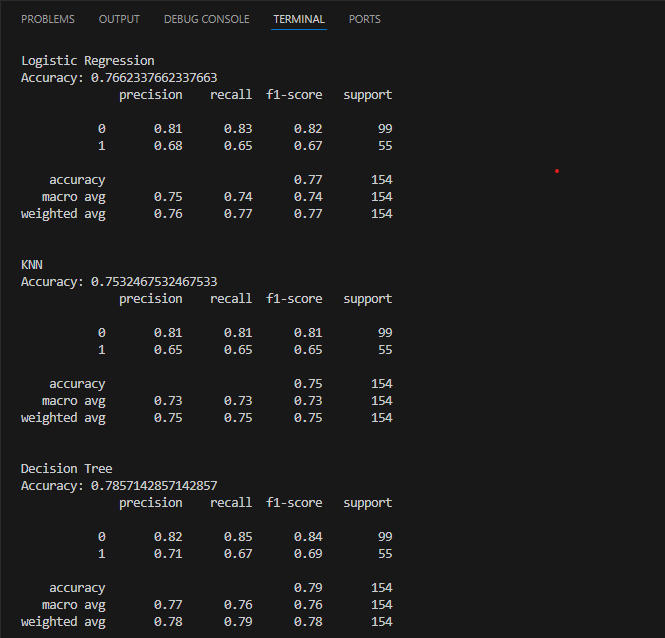
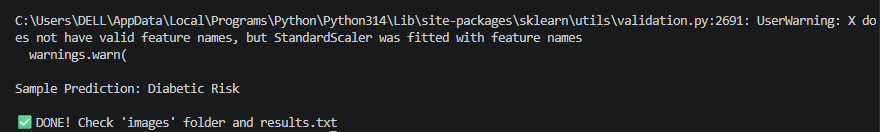
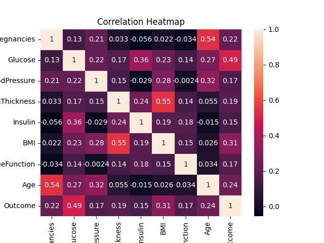
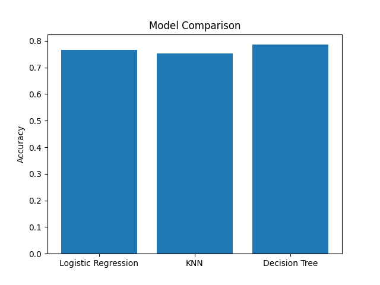
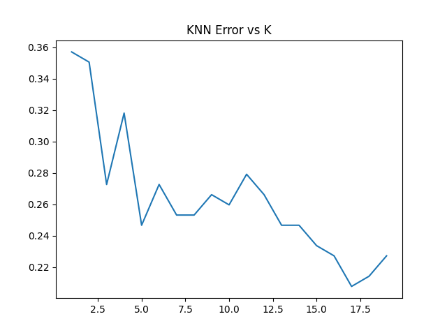
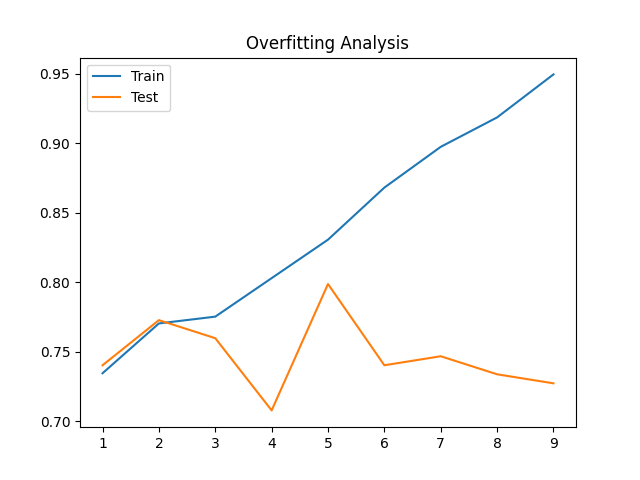
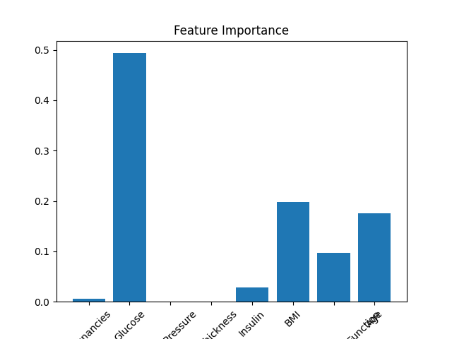
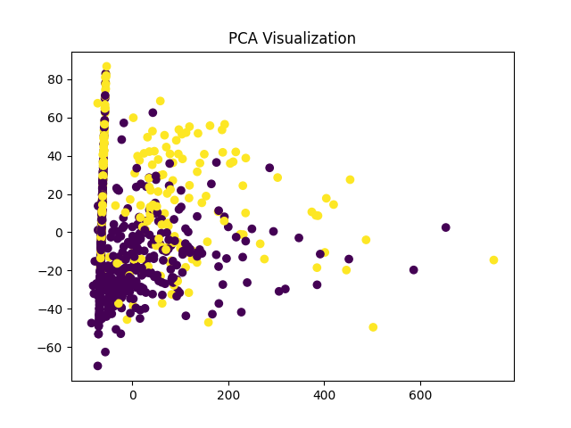

# GlucoGuard AI 🩺
### *Predicting who needs a blood test — before they know they need one*

> **BYOP Project · Fundamentals of AI & ML · B.Tech First Year**
>
> **Author:** Prisha Choithani &nbsp;|&nbsp; **GitHub:** [@prishachoithani](https://github.com/prishachoithani)

---

## 🔬 The Real Problem — Why Not Just Get a Blood Test? prishaaaaaa

> *"If diabetes can be confirmed with a blood test, why build an ML model at all?"*

This is the right question to ask — and the answer is what makes this project meaningful.

A blood test **confirms** diabetes. But confirmation is only useful if you already suspect the disease. The real crisis is the **silent majority** — people who have no idea they are at risk and will never walk into a lab until it is too late.

Consider the ground reality in India:

- Over **57 million people** live with **undiagnosed** Type 2 diabetes
- Type 2 diabetes is **symptom-free for years** — you feel completely normal while the disease progresses
- A blood test requires a lab, a doctor's prescription, and awareness that you need one
- In rural and semi-urban areas, all three of these are hard to access simultaneously

**GlucoGuard AI answers a fundamentally different question:**

> *"Given a patient's basic biometric data — weight, blood pressure, age, glucose reading — should this person be urgently flagged for a clinical test?"*

This is a **triage tool**, not a diagnostic tool. The difference is everything.

A blood test tells you *"yes, you have diabetes."*
GlucoGuard tells you *"you have a high probability of being diabetic — go get tested right now, before it's too late."*

The real power is in the **pre-diabetic window**. Type 2 diabetes doesn't appear overnight — it develops over years through a reversible pre-diabetic stage. Caught in this window, the condition can be reversed entirely through diet and lifestyle changes. Caught after symptoms appear, it cannot.

A machine learning model running on a ₹0 input form can flag high-risk individuals **years before** a blood test would ever be ordered. That is what makes this project matter.

---

## 📊 Results & Outputs

### Terminal Output — Model Accuracy Reports



The classification report shows results for all three models. Decision Tree leads with **78.57% accuracy**, followed by Logistic Regression at **76.62%** and KNN at **75.32%**. Precision and recall are reported separately for each class — recall on the diabetic class (class 1) is the more important metric in a healthcare screening context.



Final prediction output confirms the model correctly identifies diabetic risk from a sample input, with the program completing successfully and all outputs saved.

---

### Correlation Heatmap



Shows the correlation between all 8 features and the target variable `Outcome`. **Glucose (0.49)** and **BMI (0.31)** are the strongest predictors of diabetes. Age and Pregnancies also show meaningful correlation. BloodPressure and SkinThickness are the weakest, which is confirmed later by feature importance.

---

### Model Comparison



Bar chart comparing test accuracy across all three classifiers. Decision Tree achieves the highest accuracy at ~0.79, demonstrating that non-linear decision boundaries are better suited to this dataset than the linear boundary used by Logistic Regression.

---

### KNN Hyperparameter Tuning — Error vs K



Sweeping k from 1 to 19 reveals the **bias-variance tradeoff** in action. At low k (k=1), the model overfits — error is high on unseen data. As k increases, error generally decreases and stabilises. This plot was used to select the optimal k value for the final KNN model.

---

### Decision Tree Overfitting Analysis



This learning curve clearly shows the classic overfitting pattern — **train accuracy (blue) climbs toward 95%** as tree depth increases, while **test accuracy (orange) plateaus around 77–79%** and becomes unstable. This is precisely the bias-variance tradeoff: an unconstrained tree memorises training data but fails to generalise. A depth-limited tree is used in the final model to control this.

---

### Feature Importance



**Glucose dominates with an importance score of ~0.51** — nearly 3× higher than the next feature. BMI (~0.20) and Age (~0.16) are the second and third most important predictors. DiabetesPedigreeFunction contributes moderately. Pregnancies, BloodPressure, SkinThickness, and Insulin contribute minimally. This matches established clinical knowledge — blood glucose is the primary biomarker of diabetes.

---

### PCA Visualisation



All 8 features are compressed into 2 principal components and plotted. **Purple = No Diabetes, Yellow = Diabetes.** The two classes show partial separation, confirming that the features contain learnable signal even in 2D. The spread of yellow points into higher PC1 values suggests that the diabetic class has distinct variance patterns that the classifiers can exploit.

---

## 📁 Project Structure

```
GlucoGuard-AI/
│
├── main.py                        ← Entry point — run this
│
├── src/
│   ├── data_preprocessing.py      ← Load, clean, scale, split
│   ├── train_models.py            ← Train all 3 classifiers
│   ├── evaluation.py              ← Metrics, accuracy, reports
│   ├── visualization.py           ← All 6 plot functions
│   └── predict.py                 ← Risk prediction function
│
├── data/
│   └── diabetes.csv               ← PIMA Indians dataset
│
├── images/                        ← All output plots live here
│
├── results.txt                    ← Model metrics written here
├── requirements.txt
└── README.md
```

---

## 🗃️ Dataset

**PIMA Indians Diabetes Dataset**
Collected by the National Institute of Diabetes and Digestive and Kidney Diseases (1988). One of the most cited medical ML benchmarks in existence.

- **768** patient records · female · age ≥ 21
- **8** non-invasive input features
- **1** binary target: `Outcome` — 0 = No Diabetes, 1 = Diabetes
- Class split: ~65% non-diabetic · ~35% diabetic

| Feature | Description | Clinical Relevance |
|---|---|---|
| `Pregnancies` | Number of pregnancies | Gestational diabetes is a known risk factor |
| `Glucose` | Plasma glucose (2-hr OGTT) | The single strongest predictor |
| `BloodPressure` | Diastolic BP (mm Hg) | Hypertension frequently co-occurs with diabetes |
| `SkinThickness` | Triceps skinfold (mm) | Proxy for body fat distribution |
| `Insulin` | 2-hr serum insulin (µU/ml) | Measures insulin resistance directly |
| `BMI` | Body mass index (kg/m²) | Second strongest predictor after glucose |
| `DiabetesPedigreeFunction` | Genetic/family history score | Quantifies hereditary risk |
| `Age` | Age in years | Risk rises sharply after age 45 |

---

## ⚙️ Setup & Running the Project

### Requirements
- Python 3.8+

### Steps

```bash
# 1. Clone the repo
git clone https://github.com/prishachoithani/GlucoGuard-AI.git
cd GlucoGuard-AI

# 2. Create a virtual environment (recommended)
python -m venv venv

# Windows
venv\Scripts\activate
# macOS / Linux
source venv/bin/activate

# 3. Install dependencies
pip install -r requirements.txt

# 4. Run the project
python main.py
```

### Expected Terminal Output
```
✅ Data loaded and preprocessed
✅ Models trained
✅ Evaluation complete

Sample Prediction: Diabetic Risk

✅ DONE! Check 'images' folder and results.txt
```

---

## 🤖 Models & Why Each Was Chosen

| Model | Core Idea | Why Included |
|---|---|---|
| **Logistic Regression** | Estimates probability using the sigmoid function | Interpretable, outputs a risk probability not just a label |
| **Decision Tree** | Recursive if-else splits on feature values | Rules readable by a clinician; clearly demonstrates overfitting |
| **K-Nearest Neighbours** | Classifies by majority vote of k nearest points | Perfect for demonstrating bias-variance tradeoff via k-sweep |

---

## 📈 Course Concepts Applied

| Concept from Syllabus | Where It Appears in This Project |
|---|---|
| Supervised Learning | All 3 models trained on labelled patient records |
| Binary Classification | Diabetic vs Non-Diabetic prediction |
| Bayesian Statistics | Probabilistic reasoning in prediction output |
| Probability Theory | `predict_proba()` outputs, precision/recall metrics |
| Overfitting & Underfitting | Decision tree depth analysis — train vs test curve |
| Bias-Variance Tradeoff | KNN error vs k plot |
| Hyperparameter Tuning | k=1 to 19 sweep for KNN |
| Cross-Validation | Train/test split with stratification |
| Feature Scaling | StandardScaler — fit on train only, no data leakage |
| Dimensionality Reduction | PCA for 2D class-separation visualisation |
| Feature Importance | Bar chart showing relative predictor strength |
| Curse of Dimensionality | KNN sensitivity to irrelevant features |
| Statistical Decision Theory | Threshold-based classification at 0.5 |

---

## ⚠️ Limitations

- **This is a screening tool, not a medical diagnosis.** Every high-risk output must be followed up with a clinical blood test.
- Dataset represents a specific demographic — Pima Indian women aged 21+. Generalisation to broader populations requires retraining on more diverse data.
- Class imbalance (65:35) means recall on the diabetic class matters more than overall accuracy. Missing a true diabetic is more costly than a false alarm.
- No ML model should be deployed in a real healthcare setting without clinical validation, regulatory review, and bias auditing.

---

## 📄 References

1. Smith, J.W. et al. (1988). *Using the ADAP Learning Algorithm to Forecast the Onset of Diabetes Mellitus.* Annual Symposium on Computer Application in Medical Care.
2. UCI Machine Learning Repository — PIMA Indians Diabetes Dataset. https://archive.ics.uci.edu/ml/datasets/diabetes
3. Scikit-learn Documentation. https://scikit-learn.org
4. Géron, A. (2022). *Hands-On Machine Learning with Scikit-Learn, Keras & TensorFlow.* O'Reilly Media.

---

<p align="center">
  <sub>Built for a B.Tech AIML course · Designed around a real problem · <a href="https://github.com/prishachoithani/GlucoGuard-AI">prishachoithani/GlucoGuard-AI</a></sub>
</p>
